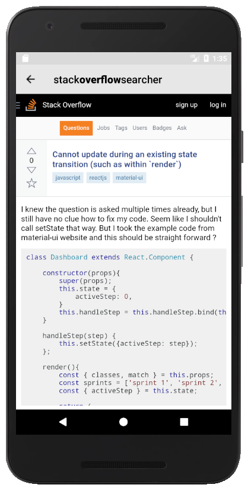

# StackOverflowSearcher

Simple repository to search StackOverflow questions and details by web view.

---

## Credits:
#### 1. Libraries
[Support Library Packages](https://developer.android.com/topic/libraries/support-library/packages "Support Library Packages") - used to adjust and for better handling of list and grid views.

[Butter Knife](http://jakewharton.github.io/butterknife) - used to find and automatically cast the corresponding view in layout.

[Picasso](http://square.github.io/picasso) - used to speed up loading of images.

[Retrofit](https://square.github.io/retrofit) - used to manage connections with server and handle JSON to POJO deserialization with ease. Also retrofit handles Gzip decompression in the fly.

[Okhttp](http://square.github.io/okhttp) - used to support all requests and responses.

[Gson](https://github.com/google/gson) - used to convert Java Objects into their JSON representation.

#### 2. Other resources
[Stack overflow](https://stackoverflow.com) - downloaded logo.

[Material design icons](https://github.com/google/material-design-icons) - used to download and set icons (e. g. in drawer).

## Screens:

